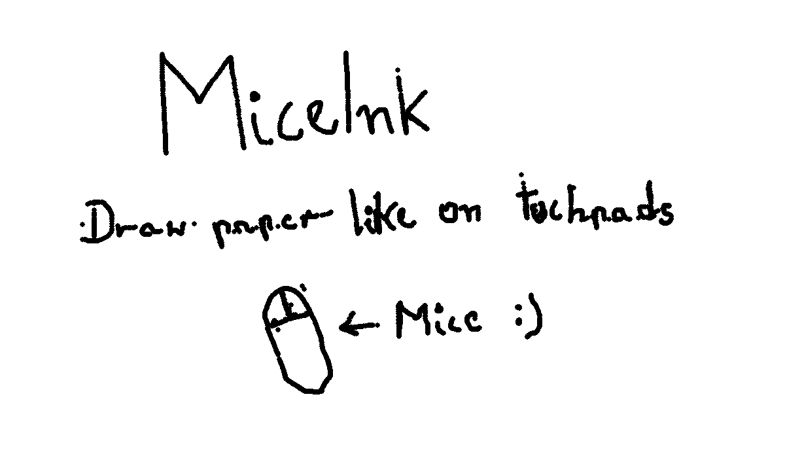
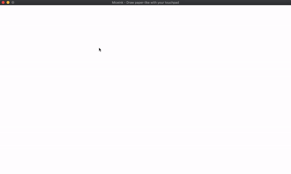

<!-- to check -->

## Mice Ink
*Creates paper like drawing experience on computers* 
[View online demo to see how it works](https://mondonno.github.io/miceInk/)

**Warning!** Online demo makes only representative role, it can have some unexpected bugs that are fixed in main program, or features.

## What is it?
Miceink is app created to create paper-like drawing experience on touchpads and mouses 
With Miceink you can draw on your touchpad with ease 

Create quick-notes, think and solve math problems with ease on your computer! 
It is very natural and experience is very simmilar to a paper-drawing :)

## MiceInk in action 

    
    
    
    

## What about Inklet?
With inklet you need to click every time if you want to turn off the pen 
in miceink you do not need any switching, just draw like on paper (but you can, if you want)

## How it works?

Miceink detects speed of your mouse movement. 
Then it provides process to check if the move is consitent, if it is MiceInk turns on the pen if not it turns it off.

## How to run?

MiceInk requires python version `>= 3v` 

Running can be done in 4 steps

1. Launch terminal
2. Install GUI library `pip3 install pygame` (or with normal pip `pip install pygame`)
3. Clone the repository `git clone https://github.com/Mondonno/miceink.git`
4. Type `cd src`
5. Then run it via python `python3 main.py`

## Usage

It is very simple. 
After you ran app, click to enable the system (program needs to know when you started drawing).
If you drawing something it automatically turns on/off your pen.

### List of commands

**Left click** `->` Toogles the drawing system 
**"S" key** `->` Saves your current work into `miceink YY-MM-DD HH:Mm:Ss.png` in `../out` dir. 
**"C" key** `->` Clears the miceink window

## Can I contribute?

If you think that project can be improved you're welcome to create issues, and PR's

There is also list of things that we might do in the projects tab 
If you want, you can help us achiing something listed there,