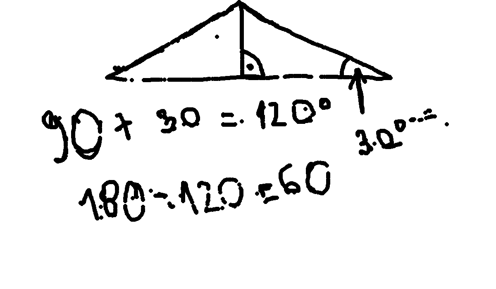
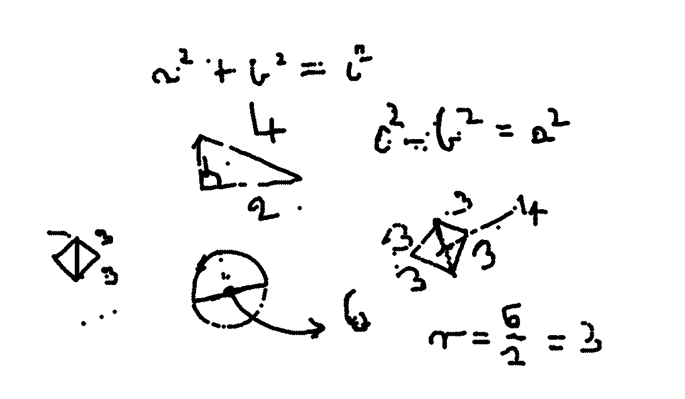
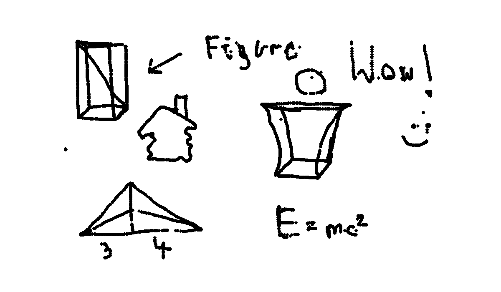
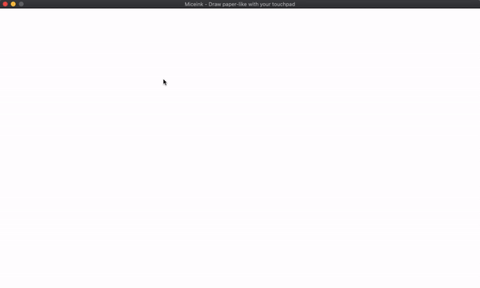

<!-- to check -->

## FeelInk
*Creates paper like drawing experience on desktops* 
[View online demo to see how it works](https://mondonno.github.io/feelInk/)

**Warning!** Online demo does NOT have implemented intelligent features.

## What is it?
**FeelInk** is app created to create paper-like drawing experience on touchpads and mouses 
With **FeelInk** you can draw on your touchpad with ease 
It creates very natural and experience is very simmilar to a paper-drawing.

# Features

- **Intelligent** drawing experience
- You do not need to change your pen's state (drawing/not drawing)
- Enables fully focus *zen mode* on creating notes
- Simple interface
- Very **light** and blazingly **fast**

## FeelInk in action 

    
    
    
    

## How it works?

It measures your traditions in drawing when you're using app: Speed, Movment, Style and bunch of others.
Then creates a profile, it is updated everey time when you moving your mouse. It is checked every time you using **FeelInk** and intelligently helps you with changing pen's state.

## Running

Our app requires python version `>= 3` 

Running can be done in 4 steps

1. Launch terminal
2. Install GUI library `pip3 install pygame` (or with normal pip `pip install pygame`)
3. Clone the repository `git clone https://github.com/Mondonno/feelInk.git`
4. Type `cd src`
5. Then run it via python `python3 main.py`

To compile it into standalone binary follow `compile.txt`

### List of commands

- **Left click** `->` Toogles the drawing state manually 
- **"S" key** `->` Saves your current work into `../out/*` directory. 
- **"C" key** `->` Clears the app canvas.